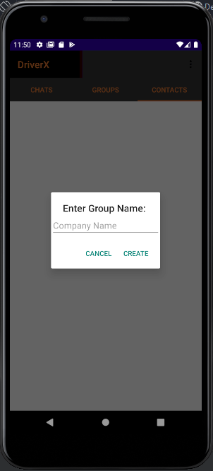

# DriverManagementApp
 
 
4th year major project -  Android Java Mobile software application catered towards businesses that operate fleets of drivers as a core business process – Centralised application for all daily operations and communications between drivers and management.
Technologies:
(Java, Android studio, Firebase)
 
CURRENTLY UNDER DEVELOPMENT
 
Features: 
User accounts: Management & Drivers (Seperate respective dashboards) 
Cloud messaging & Notification functionalities 
Private and group messaging feature 
OCR camera API for scanning of addresses and order documentation 
Maps, route planning and optimisation 
Driver Location Tracking 
Customisable UI user can choose the dashboards they wish to use, content of messaging and notification components are customisable to users preferences 
Firebase backend integration:  
  Authentication(Email/password/Phone number)  
  Database 
  Storage 
  Cloud messaging 
   
  Login/Register
  
  
  
  
  
   
 
  
  
  
  
  
   
 
  
   
 
  
  
  
  

   
  
  
  
